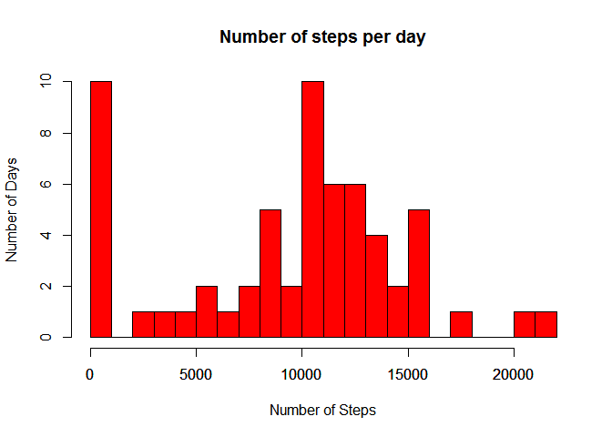
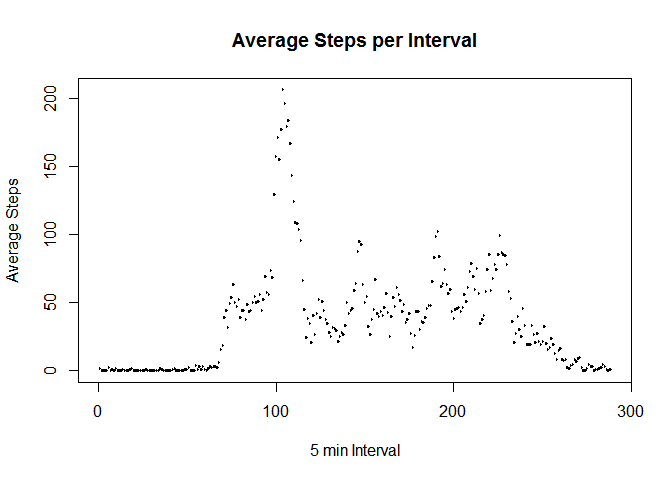
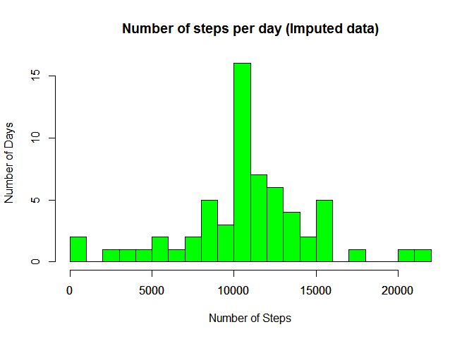
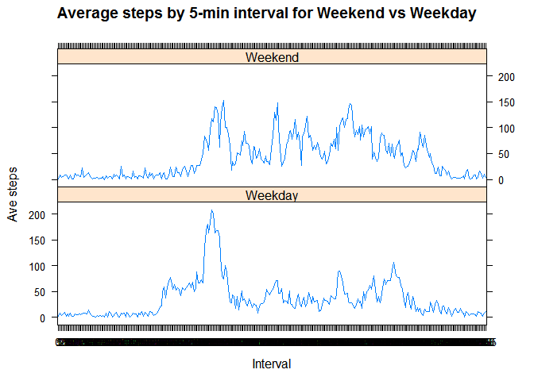

# PA1_1template
Bockwai  
October 13, 2015  
# Peer Assessment 1 Reproducible Research
---
## Set global options, load libraries


```r
library(lattice)
library(knitr)
library(dplyr)
```

```
## 
## Attaching package: 'dplyr'
## 
## The following objects are masked from 'package:stats':
## 
##     filter, lag
## 
## The following objects are masked from 'package:base':
## 
##     intersect, setdiff, setequal, union
```

```r
opts_chunk$set(echo=TRUE,results="show",cache=TRUE) ##set echo to show code and results, turn on cache
```

Read in the data from local zip file.


```r
unzip("repdata-data-activity.zip")
activitydata = read.table("activity.csv",header=TRUE,stringsAsFactors=FALSE,sep = ",",colClasses = c("numeric","Date","numeric")
)
```

# What is mean total number of steps taken per day?
Missing values are ignored in the dataset. Aggregate the number of steps per day.


```r
stepsperday = aggregate(activitydata$steps,list(date=activitydata$date),sum,na.rm=TRUE)
```

Plot Histogram of total number of steps taken per day.


```r
hist(stepsperday$x,
     main = "Number of steps per day",
     col = "red",
     breaks = 25,
     xlab = "Number of Steps",
     ylab = "Number of Days")
axis(side = 1,at=NULL)
```

 
Calculate the mean steps per day

```r
mean(stepsperday$x)
```

```
## [1] 9354.23
```
Calculate the median steps per day

```r
median(stepsperday$x)
```

```
## [1] 10395
```
# What is the average daily activity pattern?

Generate a factor of the interval for time of day.  Then calculate the ave steps for each interval with group_by and summarise from dplyr package.


```r
activitydata$interval = as.factor(activitydata$interval)
activitydata.interval = activitydata%>%group_by(interval)%>%summarise(avesteps=mean(steps,na.rm=TRUE))
```
Make a time series plot (i.e. type = "l") of the 5-minute interval (x-axis) and the average number of steps taken, averaged across all days (y-axis)


```r
plot(activitydata.interval$interval,activitydata.interval$avesteps,type="l",xaxt="n",xlab="5 min Interval",ylab="Average Steps",main="Average Steps per Interval")
axis(1,at=seq(0,2400,by=100))
```

 

```r
activitydata.interval$interval = as.numeric(as.character(activitydata.interval$interval))
```
Which 5-minute interval, on average across all the days in the dataset, contains the maximum number of steps?


```r
activitydata.interval$interval[which.max(activitydata.interval$avesteps)]
```

```
## [1] 835
```
# Imputing Missing Values

Calculate and report the total number of missing values in the dataset (i.e. the total number of rows with NAs)


```r
sum(is.na(activitydata))
```

```
## [1] 2304
```

Devise a strategy for filling in all of the missing values in the dataset. The strategy does not need to be sophisticated. For example, you could use the mean/median for that day, or the mean for that 5-minute interval, etc.
I will use mean data and create a new dataset with missing values filled in.


```r
# merge ave into data frame by interval and replace NA values with avesteps values with ifelse conditional element selection
imputeddata = merge(activitydata,activitydata.interval,by="interval",all.x = TRUE)
imputeddata$imputedsteps = ifelse(is.na(imputeddata$steps),activitydata.interval$avesteps,imputeddata$steps)
```

Plot a histogram of the revised dataset with imputed missing values.


```r
# Copied previous aggregate and hist code for imputed steps histogram
imputedstepsperday = aggregate(imputeddata$imputedsteps,list(date=imputeddata$date),sum)
hist(imputedstepsperday$x,
     main = "Number of steps per day (Imputed data)",
     col = "green",
     breaks = 25,
     xlab = "Number of Steps",
     ylab = "Number of Days")
axis(side = 1,at=NULL)
```

 
Calculate the mean total steps with imputed data

```r
mean(imputedstepsperday$x)
```

```
## [1] 10749.09
```
Calculate the median total steps with imputed data

```r
median(imputedstepsperday$x)
```

```
## [1] 10765
```
The values for mean and median using imputed data differ from the values without imputed data. By using mean data the histogram with imputed data will cause data aggregation toward the mean.

Create a new factor variable in the dataset with two levels - "weekday" and "weekend" indicating whether a given date is a weekday or weekend day.


```r
imputeddata$weekday = weekdays(imputeddata$date)
imputeddata$weekend = ifelse(imputeddata$weekday=="Saturday"|imputeddata$weekday=="Sunday","Weekend","Weekday")
imputeddataweekend = aggregate(imputeddata$imputedsteps,list(weekend=imputeddata$weekend,time=imputeddata$interval),mean,na.rm=TRUE)
```
Create a panel plot containing time series plot of the 5-min interval (x-axis)
and the ave steps taken, averaged across all weekdays and weekend days (y-axis).  Plot modeled after README file in the Github repo.

```r
xyplot(x~time|weekend,
      data=imputeddataweekend,
      type="l",
      layout = c(1,2),
      xlab = "Interval",
      ylab = "Ave steps",
      main = "Average steps by 5-min interval for Weekend vs Weekday"
      )
```

 
